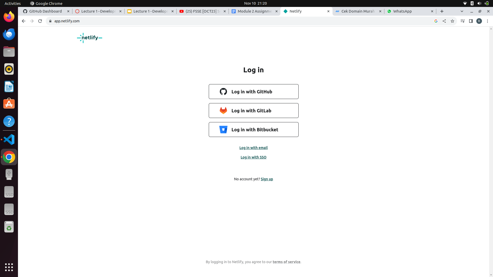
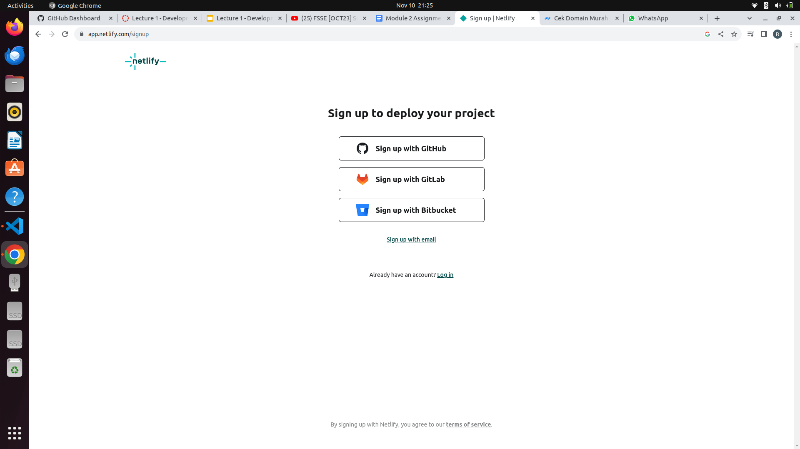
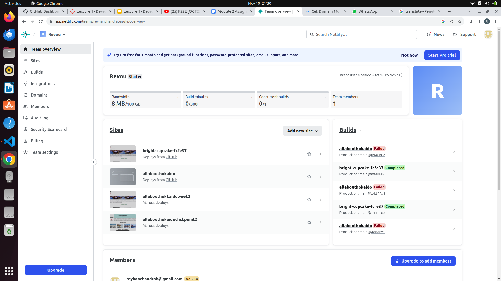
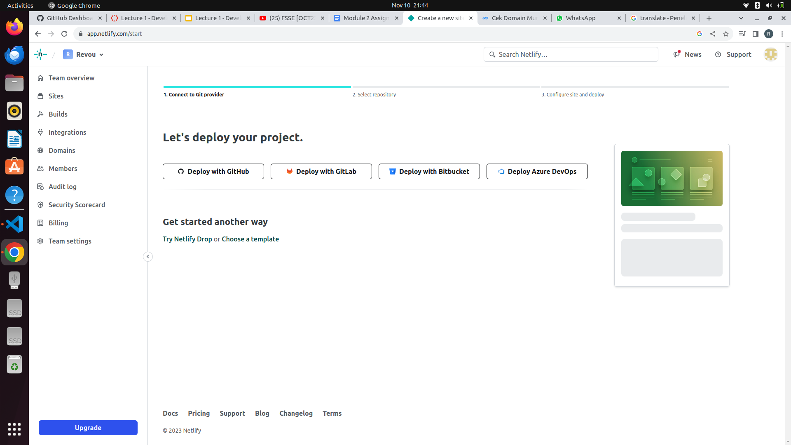
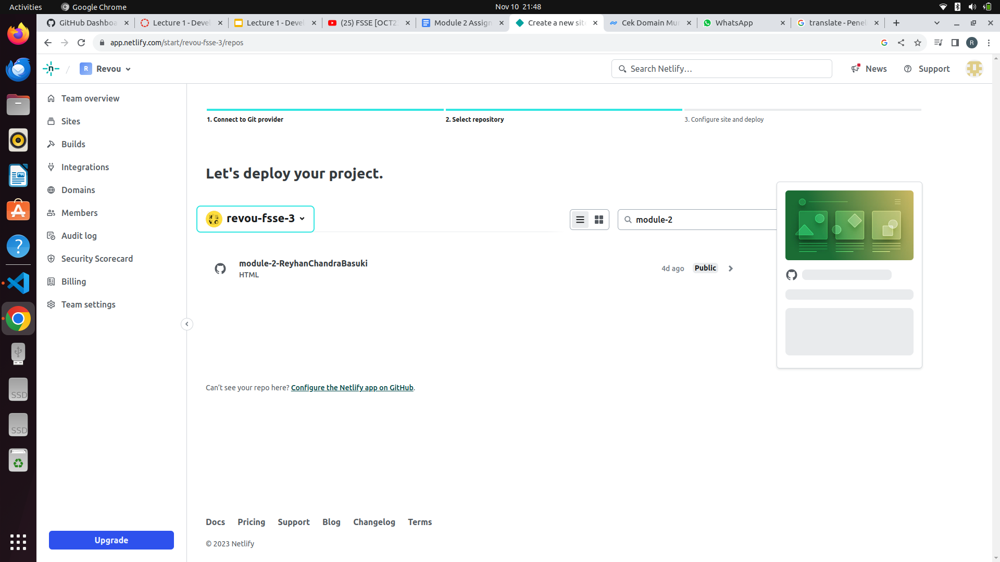
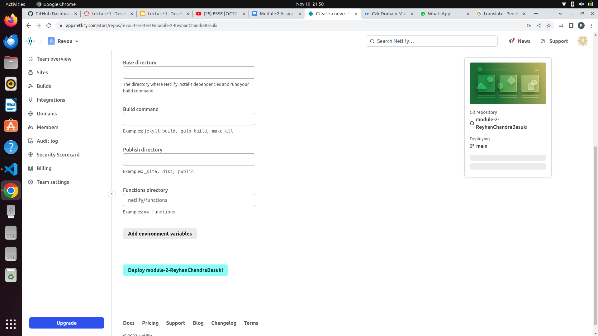
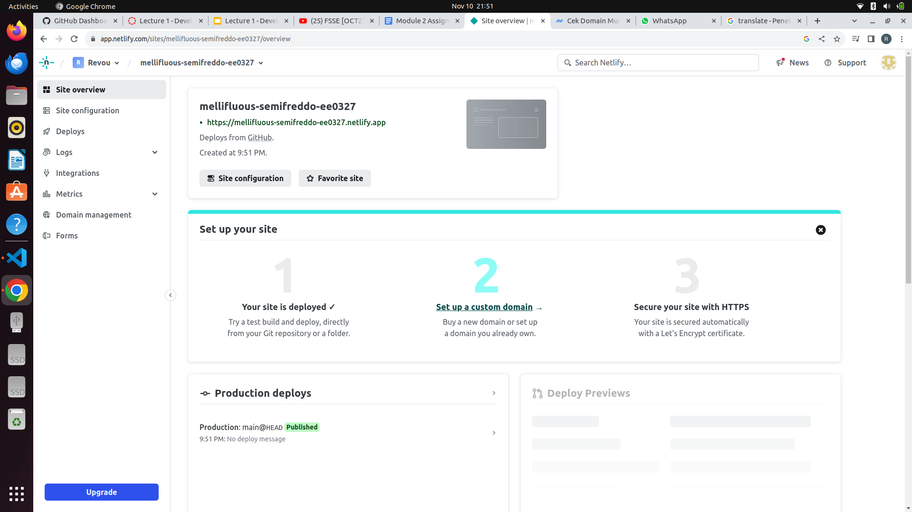
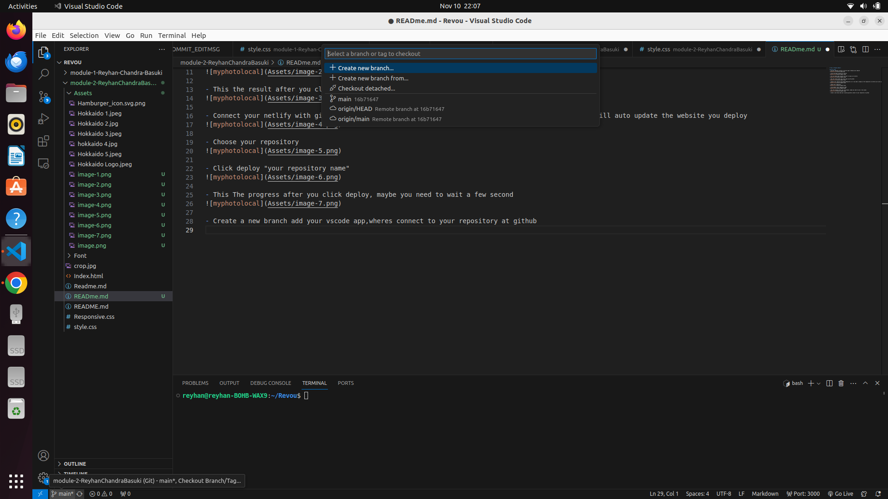
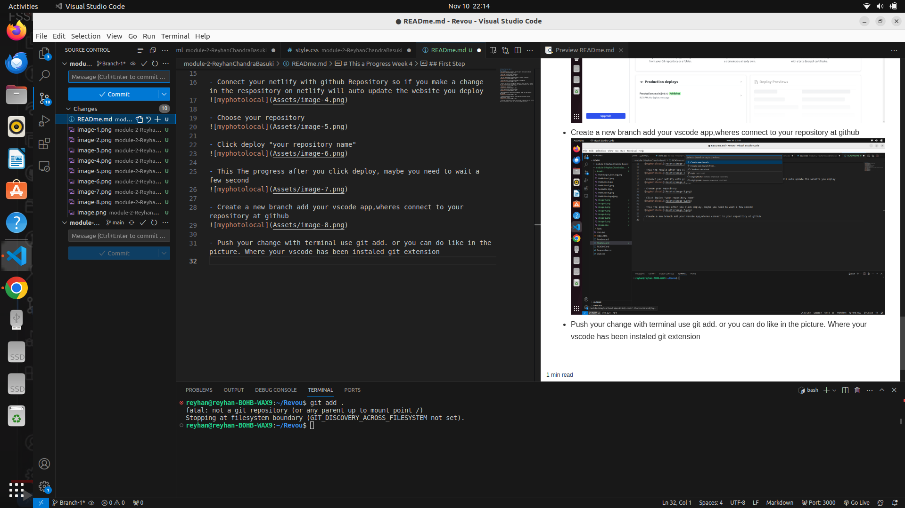

# This a Progress Week 4

## First Step
- You must register account at netlify.app to deploy your website

- Click The Sign up button at netlify 

- You can choose what account you want to sign up to netlify

- This the result after you click sign up with github

- Connect your netlify with github Repository so if you make a change in the respository on netlify will auto update the website you deploy

- Choose your repository 

- Click deploy "your repository name"

- This The progress after you click deploy, maybe you need to wait a few second

- Create a new branch add your vscode app,wheres connect to your repository at github

- Push your change with terminal use git add. or you can do like in the picture. Where your vscode has been instaled git extension

- You must name your push so at your repository will be shows how much commit you do
- after give a name you click "commit" that will be push to your new branch at repository