# This a Progress Week 4

## First Step
- You must register account at netlify.app to deploy your website

- Click The Sign up button at netlify 

- You can choose what account you want to sign up to netlify

- This the result after you click sign up with github

- Connect your netlify with github Repository so if you make a change in the respository on netlify will auto update the website you deploy

- Choose your repository 

- Click deploy "your repository name"

- This The progress after you click deploy, maybe you need to wait a few second

- Create a new branch add your vscode app,wheres connect to your repository at github

- Push your change with terminal use git add. or you can do like in the picture. Where your vscode has been instaled git extension

- You must name your push so at your repository will be shows how much commit you do
- after give a name you click "commit" that will be push to your new branch at repository
- This the result after you all commit to your branch
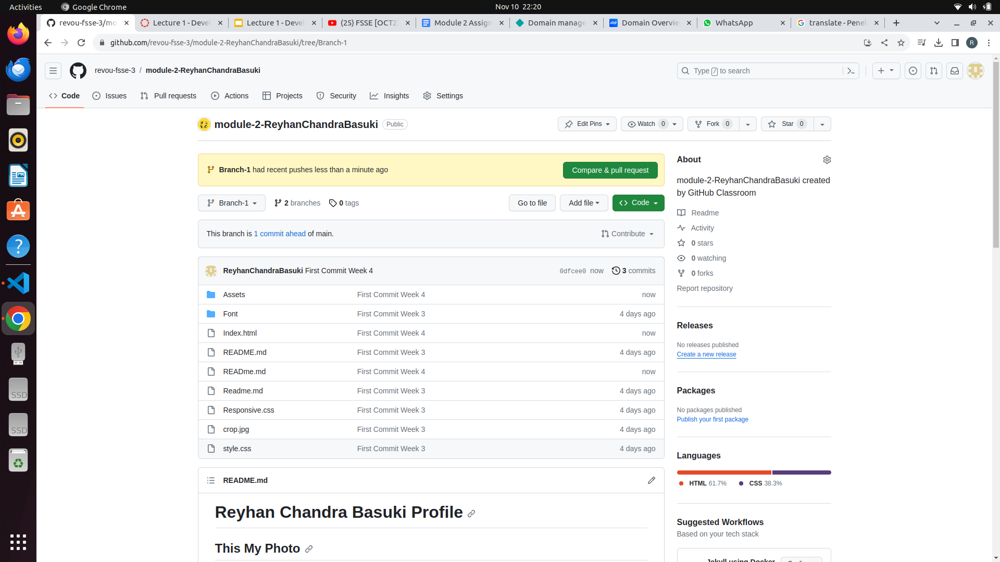
- After that you click pull request at github web
- Choose compare & pull request 
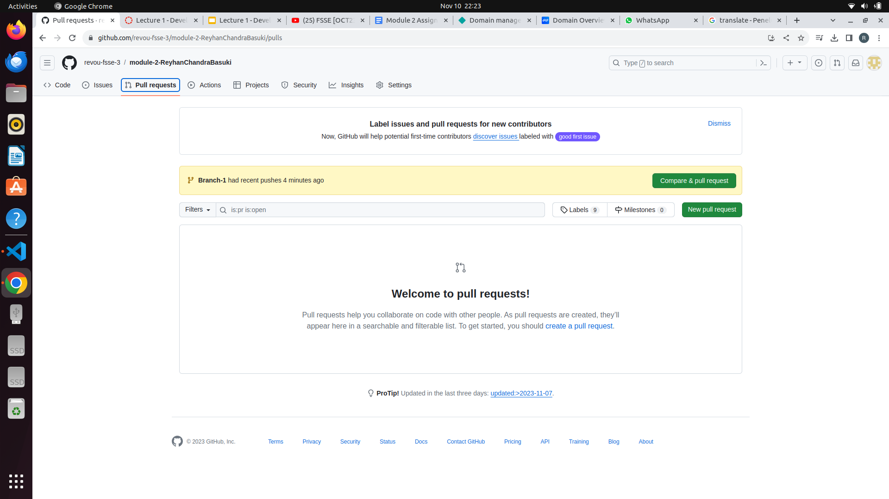
- Write the description this important to do, this will use if you have team project so the team will know who this job and what different 
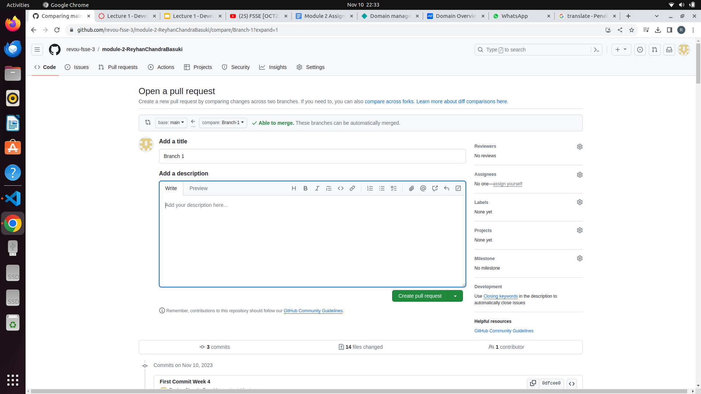
- After that click create pull request
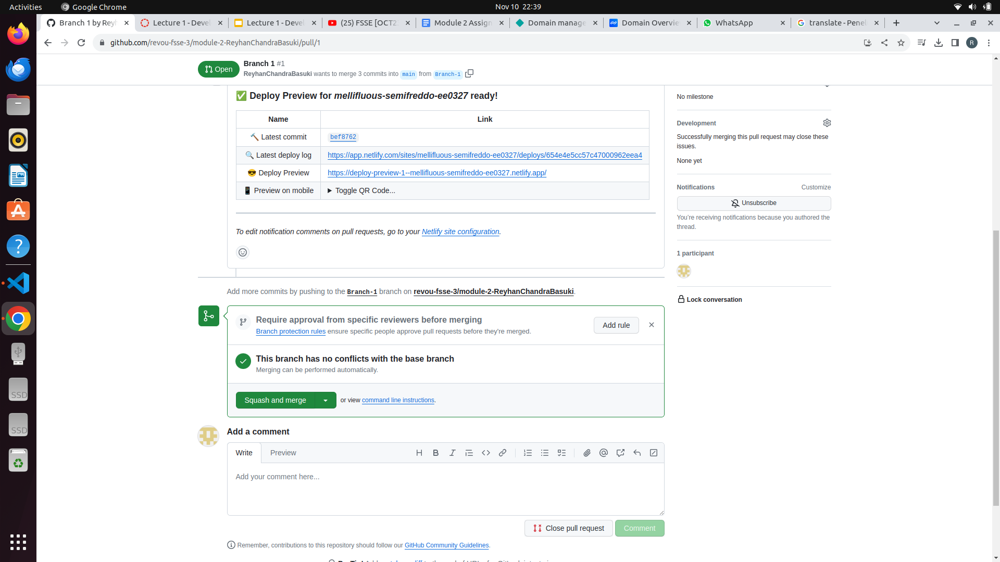
- After that github will check your pull request is okay to merged or not, if okay you can choose what type of merge you want
- This the result after merge your branch to your main on the repository
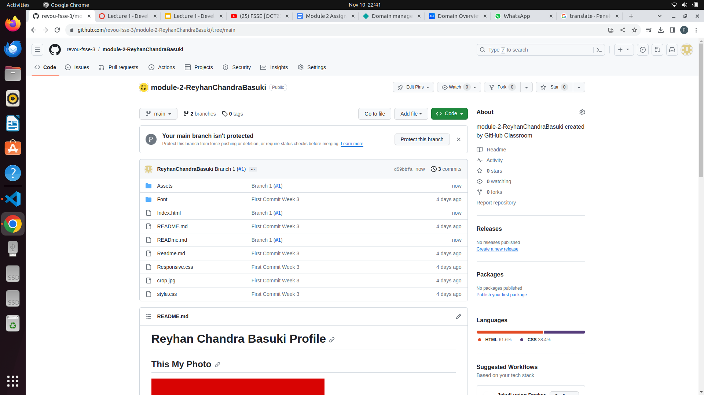
- At netlify what you already deploy from github if there any change the netlify will be automaticly redeploy your website to the new change you do
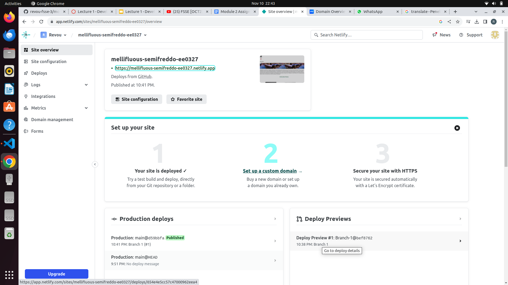
- After that you can buy your domain anywhere but here i buy a domain at niagahoster, you can choose what kind domain you want with various cost variants
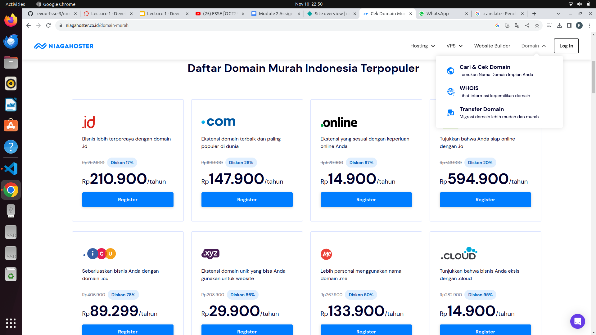
- if you want to buy a domain you need to sign up to website or login with google and facebook 
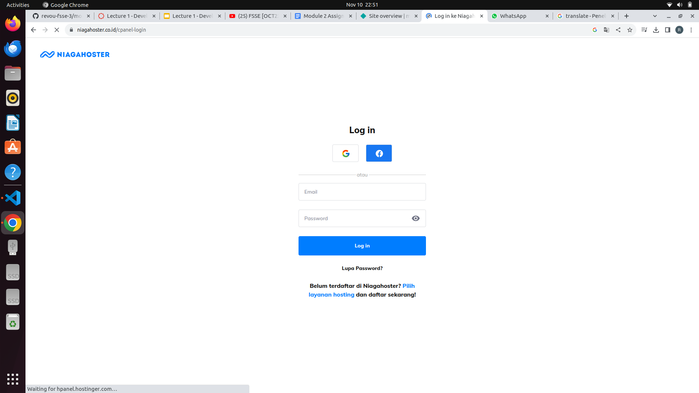
- You can choose what payment method you want use to pay the domain you buy
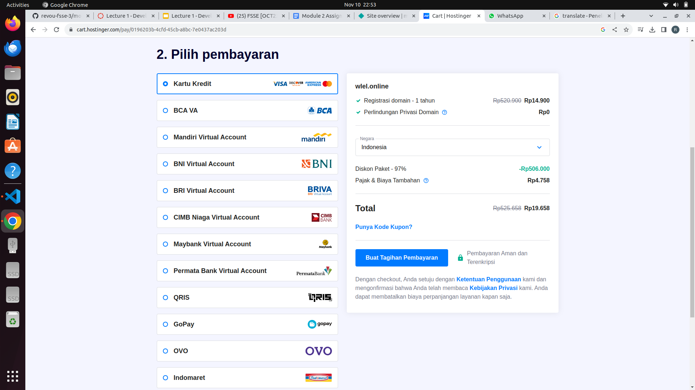
- After buy you can setting your domain and can use at netlify 
- At netlify you can choose your web and choose domain management after that choose add domain, fill that with the domain name you buy
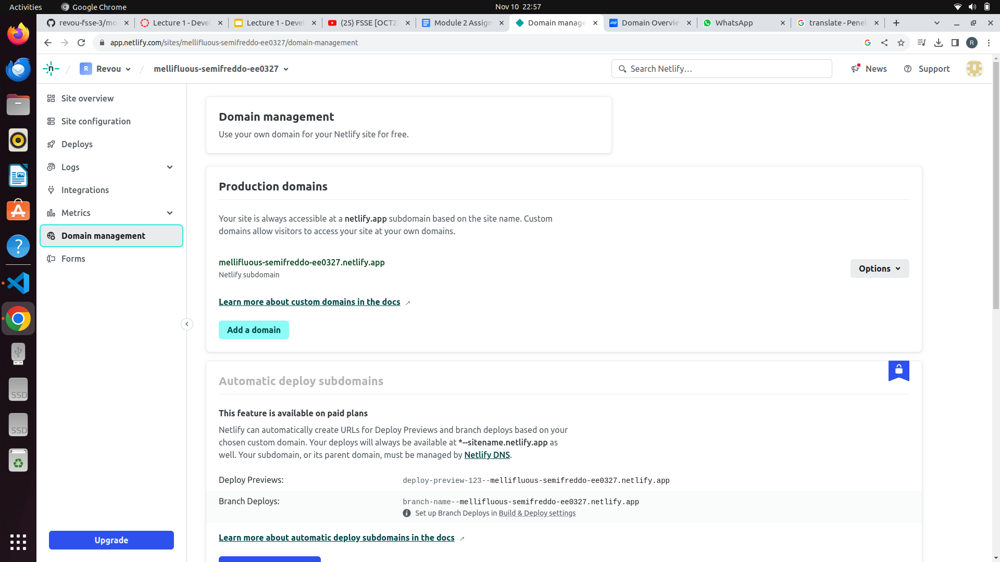
- After that click add domain
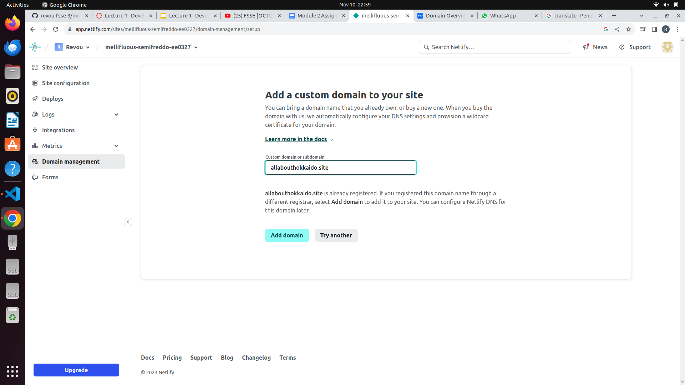
- After That you can signup to cloudflare to protect your website, after signup you click website and fill the blank with your domain name
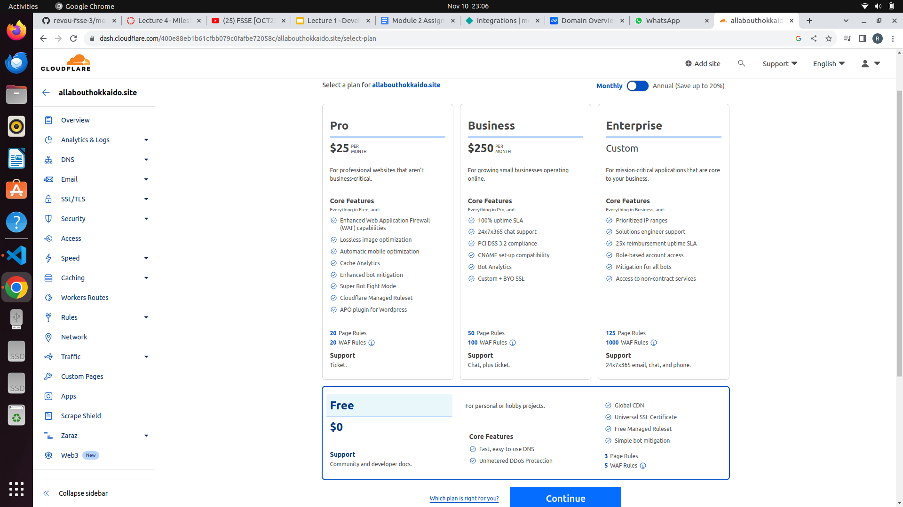
- Choose the free plan

##The Result
Layout:http://allabouthokkaido.site/
Belum bisa jalan karna DNS masih waiting 1 day